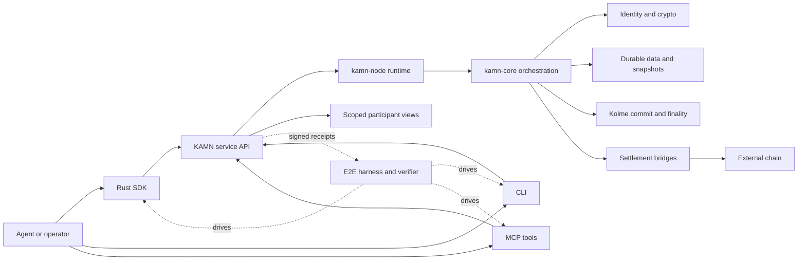

# KAMN

**Authenticated coordination and verifiable settlement evidence for autonomous
agents.**

KAMN (Kolme AI Agent Messaging Network) is a Rust network and service stack for
agents that need to identify one another, exchange private messages, coordinate
tasks, and prove what happened after the participants have disconnected.

KAMN is in active development. This repository proves bounded local and Solana
devnet workflows; it does not claim production readiness, mainnet custody,
generalized exchange, or arbitrary-partition fault tolerance.

## Why KAMN

An agent saying "I approved it" is not durable evidence. KAMN binds actions to
key-backed identities and records ordered receipts for authorization, messages,
task state, escrow, and settlement. Participants receive scoped views, while an
independent verifier can recompute shared facts from persisted evidence.

KAMN is for teams building agent workflows where these questions matter:

- Who authorized this action?
- Did every participant agree to the same terms?
- Was work delivered without exposing private participant data?
- Did settlement finalize exactly once?
- Can another process verify the answer later?

## Quickstart

With Rust, Bash, and Python 3 installed, run the bounded local proof:

```bash
make demo-mvp
```

This executes real local runtime and proof paths without claiming external
value movement. The human report is written to
`.kamn/demo/latest/proof/report.md`.

The canonical three-agent Pi and Solana devnet proof requires identity keys,
authenticated Pi access, and funded devnet keypairs. Follow the
[evaluator runbook](docs/validation/mvp-evaluator-demo.md), then run:

```bash
make demo-agent-transaction
```

Success returns `GO` only after an independent verifier accepts the persisted
bundle. A failure returns a stable reason and writes
`.kamn/demo/latest/NO-GO.txt`.

## How It Fits Together

<!-- diagram:kamn-runtime-architecture -->


The service runtime owns authenticated ingress and scoped projections.
`kamn-core` composes protocol domains; focused crates own crypto, persistence,
governance, Kolme, bridge, and guard boundaries. The harness drives public
entrypoints and verifies their durable output independently.

## Authority Flow

Service receipts, not ambient actor trust, are the settlement authority.
Receipt digests bind the same identities, resource, terms, economics, escrow,
idempotency key, transaction signature, finalized slot, and ordered chain
across SDK, CLI, and MCP views.

<!-- diagram:receipt-authority-flow -->
```mermaid
sequenceDiagram
    participant P as Providing agent
    participant K as KAMN service
    participant R as Requesting agent
    participant B as Settlement bridge
    participant C as Chain or finality
    participant V as Independent verifier
    P->>K: Quote plus terms digest
    K-->>R: Service-issued quote receipt
    R->>K: Approve with signed authority
    K-->>P: Authorized task receipt
    P->>K: Work and signed message receipts
    R->>K: Release escrow with idempotency key
    K->>B: Submit settlement exactly once
    B->>C: Transfer
    C-->>B: Finalized signature and slot
    B-->>K: Bridge and settlement receipt digests
    K-->>V: Ordered authoritative receipt chain
    V->>V: Recompute digests; reject gaps or drift
```

## What Is Proven

The canonical demo proves three key-bound agent identities, a task and
transaction lifecycle, scoped participant/public views, durable receipts, one
funded Solana devnet transfer, raw finality evidence, and offline verification.
That claim applies only when the generated report labels settlement
`devnet-backed`.

Deterministic integration tests also prove SDK/CLI/MCP contract parity and
fail-closed authority validation. They do not independently prove three funded
transfers. See the [current proven runtime slices](docs/validation/current-proven-runtime-slices.md)
for the exact boundary between behavior, integration, live, and unproven work.

| Report label | Meaning |
| --- | --- |
| `real` | Local runtime or proof behavior actually ran. |
| `local-only` | Real local behavior with no external value movement. |
| `devnet-backed` | Finalized Solana devnet evidence supports the claim. |
| `dry-run` | No live settlement; never canonical success. |
| `placeholder` / `roadmap` | Illustrative or future work; never proof. |

## Repository Map

- **Entry surfaces:** `kamn-sdk`, `kamn-cli`, `kamn-mcp-server`,
  `kamn-agent-lib`
- **Runtime composition:** `kamn-node`, `kamn-core`
- **Identity and safety:** `kamn-types`, `kamn-crypto`, `kamn-runtime-guards`
- **State:** `kamn-data-layer`, `kamn-snapshot-journal`
- **Finality and settlement:** `kamn-kolme`, `kamn-bridges`,
  `kamn-live-probe-matrix`
- **Policy:** `kamn-governance`
- **Proof:** `kamn-e2e-harness`

The [architecture index](docs/architecture/README.md) links the detailed
runtime, service, transport, persistence, finality, and module maps.

## Build And Verify

```bash
make check
make test
bash scripts/ci/check_kamn_core_missing_docs_policy.sh
cargo check -p kamn-core --no-default-features
```

The last command separately verifies the local-only `kamn-core` profile. Live
HTTPS transport uses `rustls`, `rustls-pemfile`, and `webpki-roots`; its boundary
is recorded in the [TLS transport ADR](docs/architecture/adr-kamn-core-live-tls-transport.md).

## For Agents And Maintainers

Read [AGENTS.md](AGENTS.md) before changing the repository. Every change follows
an issue, committed spec, RED/GREEN/REFACTOR tests, real integration wiring, and
evidence-backed PR. Do not weaken claim boundaries or commit secrets, keypairs,
`.kamn/` artifacts, generated package metadata, or unrelated local files.

Detailed command and policy markers live in the
[README contract reference](docs/developer/readme-contract-reference.md), not in
this onboarding surface.

## Go Deeper

- [Architecture navigation](docs/architecture/README.md)
- [Service message delivery flow](docs/architecture/service-api-delivery-flow.md)
- [Current proven runtime slices](docs/validation/current-proven-runtime-slices.md)
- [Evaluator runbook](docs/validation/mvp-evaluator-demo.md)
- [kamn-core module map](docs/architecture/kamn-core-module-map.md)
- [CI strategy](docs/ci/strategy.md)
- [Secure coding](docs/security/secure-coding.md)
