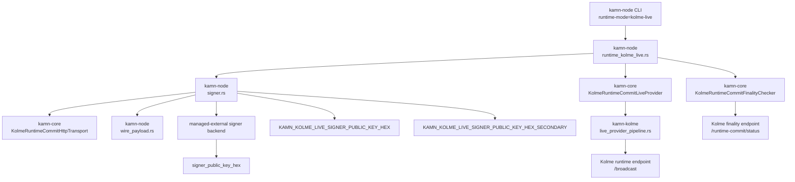

# KAMN-Kolme Runtime Architecture

This document provides a canonical, contributor-facing map of the runtime commit
execution boundary between `kamn-node`, `kamn-core`, and `kamn-kolme`.

## Runtime Flow Diagram

## Flow Notes

- `kamn-node` composes deterministic runtime requests in
  `crates/kamn-node/src/runtime_kolme_live.rs` and routes signer selection
  through `crates/kamn-node/src/signer.rs`.
- Managed-external mode requires explicit runtime signer public-key markers:
  `KAMN_KOLME_LIVE_SIGNER_PUBLIC_KEY_HEX` (primary) and
  `KAMN_KOLME_LIVE_SIGNER_PUBLIC_KEY_HEX_SECONDARY` (secondary).
- `kamn-core` exposes the compatibility/runtime provider boundary through
  `KolmeRuntimeCommitLiveProvider` and transport/finality contracts in
  `crates/kamn-core/src/kolme_runtime_commit.rs`.
- `kamn-kolme` owns the canonical live submit pipeline in
  `crates/kamn-kolme/src/live_provider_pipeline.rs`.
- Backend signer provenance remains fail-closed: runtime marker input and
  backend `signer_public_key_hex` output must agree.

## Ownership Map

- CLI/runtime orchestration: `crates/kamn-node/src/runtime_kolme_live.rs`
- Signer profile/key-source + managed-external contracts:
  `crates/kamn-node/src/signer.rs`
- Native direct message rendering: `crates/kamn-node/src/wire_payload.rs`
- Runtime provider compatibility facade:
  `crates/kamn-core/src/kolme_runtime_commit.rs`
- Live-provider config/pipeline ownership:
  `crates/kamn-kolme/src/live_provider_pipeline.rs`

## Related References

- Runtime client contracts: `docs/foundation/kolme-runtime-commit-client.md`
- Node runtime CLI contracts: `docs/foundation/node-runtime-cli.md`
- Local runbook contracts: `docs/planning/kolme-devnet-ops.md`
