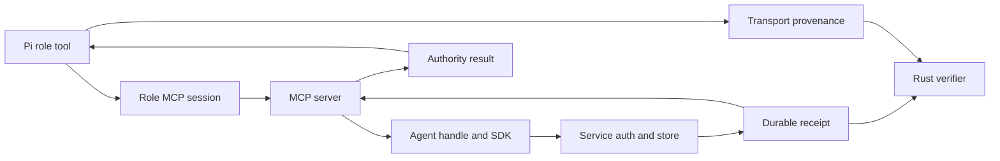

# Unify Pi and MCP Receipt Authority

## Objective

Make the live KAMN service the sole authority for canonical agent actions and
receipts. Pi remains the model-controlled orchestrator, each role keeps its own
authenticated MCP process, and the evaluator independently verifies durable
service receipts. Pi process IDs, MCP request IDs, and client-computed hashes
remain useful transport provenance but cannot authorize canonical `GO`.

This deepens the single transaction path instead of adding a new product surface
(see origin: `docs/brainstorms/2026-06-26-kamn-forward-strategy-requirements.md`).

## Current Gap

- Canonical A/B/C tools call persistent role-scoped MCP children through
  `.pi/extensions/kamn-mvp/live-task-workflow.ts` and `mcp-session.ts`.
- KAMN persists task and escrow transition receipts with actor, correlation,
  action, state, and idempotency facts in `message_store/task_models.rs`.
- Task and escrow mutation responses already expose optional `receipt_id`, but
  `crates/kamn-sdk/src/service_models.rs` and its parsers discard it.
- `crates/kamn-mcp-server/src/dispatch.rs` consequently returns only resource ID
  and state for those mutations.
- `.pi/extensions/kamn-mvp/mcp-provenance.ts` hashes MCP response JSON locally;
  `live-task-workflow-support.ts` then promotes those hashes into actor evidence.
  These hashes prove what Pi observed, not what the service durably authorized.

## Authority Contract

1. Pi chooses and sequences a role-allowed tool.
2. The role's persistent MCP child owns its KAMN identity and nonce stream.
3. The MCP server validates input and calls `KamnAgentHandle`.
4. The signed service request performs authorization and a durable state change.
5. The service returns a stable ID, canonical receipt digest, and resulting state.
6. SDK, agent-lib, and MCP preserve that receipt without substitution.
7. Pi records the service receipt plus separately labeled transport provenance.
8. Final participant/verifier projections expose a server-derived receipt-chain
   commitment; only participant views may expose allowed receipt detail.
9. The Rust verifier recomputes the commitment from persisted proof artifacts and
   rejects evidence that can be satisfied by Pi-local data alone.



## Versioned Result Shape

Define one shared Rust-owned schema, represented conceptually as:

```json
{
  "schema_version": "kamn.mcp.authority-receipt.v1",
  "source": "kamn-service",
  "actor_did": "kamn:did:...",
  "tool": "complete_task", "resource_id": "task-...",
  "resulting_state": "completed",
  "service_receipt_id": "task-transition-receipt-00000003", "service_receipt_digest": "sha256:...",
  "receipt_chain_commitment": "sha256:..."
}
```

Registration needs a durable service receipt or query-backed profile commitment.
A process ID, RPC ID, nonce, or Pi digest must never be `service_receipt_id`.

## Issue And TDD Sequence

### Child 1: Preserve Service Receipts Through SDK And MCP

- Add receipt ID/digest to the appropriate mutation models and parsers.
- Include task creation, accept, complete, escrow fund, and release. Add a durable
  registration authority receipt or a documented query-backed equivalent.
- Return a typed, versioned authority envelope from `kamn-mcp-server`; add MCP
  output schemas and validate structured results while retaining compatible text.
- Keep query results distinct from mutation receipts.
- RED: show that the existing service receipt disappears at SDK and MCP layers.
- GREEN: preserve it byte-for-byte; fail when canonical mutation responses omit it.

### Child 2: Commit The Durable Receipt Chain In Service Projections

- Canonically hash each durable receipt and link the agreement (terms/task),
  approval (accept/fund/complete/release), and confirmed settlement phases.
- Add the commitment to the shared public projection and its existing public
  commitment calculation.
- Allow A/B projections to include authorized receipt IDs/details; expose only
  the commitment and allowlisted shared facts to C.
- Make retry return the original receipt ID/digest. Reject duplicate, reordered,
  cross-resource, cross-actor, or conflicting idempotency receipt chains.
- RED: tamper persisted receipt order/actor/action and require projection failure.

### Child 3: Migrate Pi Evidence To Service Authority

- Parse and validate the versioned MCP authority result in `mcp-session.ts`.
- Replace `runtime_response_receipts` as an authority source with an ordered list
  of service receipts. Rename existing Pi hashes to `transport_response_digests`.
- Require each role's exact mutation receipt set and final service projection:
  A register/create/fund/release, B register/accept/complete, C register/query.
- Emit a v2 actor-evidence schema binding DID, receipt IDs/digests, resource IDs,
  final receipt-chain commitment, view scope, and handoff digest.
- Remove legacy local actor-receipt tools from the canonical tool allowlists, or
  label them compatibility-only and make the canonical verifier reject them.
- RED: client-only, copied, replayed, cross-role, missing, or fabricated receipts.

### Child 4: Independent Verification And Canonical Wiring

- Teach `kamn-e2e-harness` to recompute the service receipt-chain commitment from
  durable state/proof artifacts after all Pi and MCP children exit.
- Require all three actor artifacts to bind the same public commitment while
  preserving A/B private fields and C restricted-public disclosure.
- Keep issue #7125 settlement receipt and independent Solana RPC reconciliation
  mandatory; authority unification must not create a second settlement path.
- Update `agent_transaction_supervisor.rs` prompts/tool allowlists and retire any
  canonical path that accepts v1 Pi-local authority.
- Run a fresh-checkout `make demo-agent-transaction`, standalone verification,
  deliberate tamper run, and restart/retry run.

## Error Semantics

- `MCP_AUTHORITY_RECEIPT_MISSING`: canonical mutation lacks a service receipt.
- `MCP_AUTHORITY_RECEIPT_INVALID`: malformed schema, actor, tool, or resource.
- `SERVICE_RECEIPT_CHAIN_INVALID`: durable ordering or commitment mismatch.
- `PI_SERVICE_AUTHORITY_MISMATCH`: Pi evidence disagrees with service authority.
- `PI_TRANSPORT_PROVENANCE_INVALID`: request/process provenance is inconsistent.
- Interior layers return typed errors without logging. MCP/Pi/harness entrypoints
  log or render once and produce explicit `NO-GO`; no compatibility fallback.

## Cross-Layer Tests

- Real backend: one MCP task transition returns the exact service `receipt_id`.
- Three-role flow: independent nonce streams and DIDs bind one receipt chain.
- Ambiguous response: retry returns the same receipt and performs no second action.
- Service restart: persisted receipts and commitment remain independently
  verifiable after all actor/MCP processes exit.
- MCP child crash: fail that actor session and produce `NO-GO`; do not start a
  fresh nonce stream for the same DID inside the active workflow.
- Privacy: C cannot observe actor, idempotency, correlation, or private evidence
  fields beyond the allowlisted public commitment.
- Tamper: edited ID, order, actor, action, state, projection, or artifact path fails.
- Compatibility: legacy Pi-local hashes cannot satisfy canonical success.
- Settlement: one #7125 finalized signature remains bound to the same escrow.

## Quality And Delivery Gates

1. Merge #7125 and verify clean `main` before implementation branches are cut.
2. Create one GitHub issue and `specs/{issue}-{slug}.md` for each child above.
3. Obtain explicit approval for additive SDK, MCP result, and service projection
   contract changes before Phase 3 RED work.
4. Preserve separate RED, GREEN, REFACTOR, and INTEGRATION commits per child.
5. Run focused Rust and Pi tests after each child, then formatting, strict clippy,
   `make check`, package-aware `make test`, pre-push coverage, and mutation gates.
6. Push, obtain green CI, merge in dependency order, then repeat the canonical
   demo and verifier from a fresh checkout of `main`.

## Non-Goals

- OAuth or remote HTTP MCP authorization; the canonical path is local stdio with
  per-role KAMN keys and signed service requests.
- Mid-workflow MCP nonce resumption. A service-backed nonce handshake is a
  separate protocol change; child loss is fatal in this tranche.
- Stronger Agent C grant/allowlist authorization. This tranche preserves the
  existing registered restricted-public projection and its exact field allowlist.
- Mainnet, production custody, new chains, generalized exchange, or new deps.
- Redesigning tasks, escrow, settlement, Pi RPC, or the #7125 verifier.
- Exposing private receipt records to Agent C.

## Risks And Mitigations

- Public contract expansion: use additive versioned fields, fixtures, and an
  explicit approval gate; reject mixed versions only in canonical mode.
- Duplicate authority models: define the Rust service receipt as canonical and
  mechanically label every Pi-generated value as transport provenance.
- Privacy regression: compute the shared commitment server-side and test C's
  exact allowlist with secret/private markers.
- Host-heavy verification: use package roots and bounded concurrency; never
  promote partial matrices into a green gate.

## References

- Tracker/dependency: https://github.com/njfio/kamn/issues/7126 and https://github.com/njfio/kamn/issues/7125
- `docs/validation/mvp-evaluator-demo.md`
- `.pi/extensions/kamn-mvp/live-task-workflow.ts`
- `.pi/extensions/kamn-mvp/mcp-session.ts` and `mcp-provenance.ts`
- `crates/kamn-node/src/service_api_endpoint/message_store/task_models.rs`
- `crates/kamn-sdk/src/service_models.rs` and `crates/kamn-mcp-server/src/dispatch.rs`
- `crates/kamn-e2e-harness/src/agent_transaction_supervisor.rs`
- MCP [tools](https://modelcontextprotocol.io/specification/2025-11-25/server/tools), [authorization](https://modelcontextprotocol.io/specification/2025-11-25/basic/authorization), and Pi [extension API](https://github.com/earendil-works/pi/blob/main/packages/coding-agent/docs/extensions.md).
